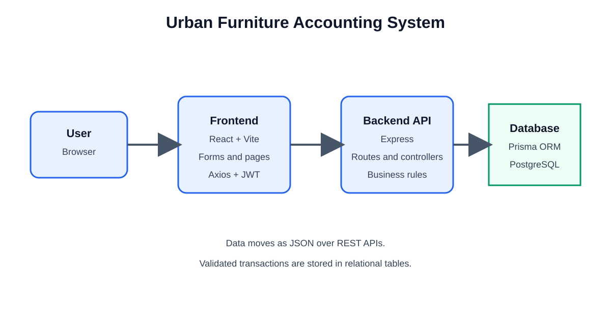
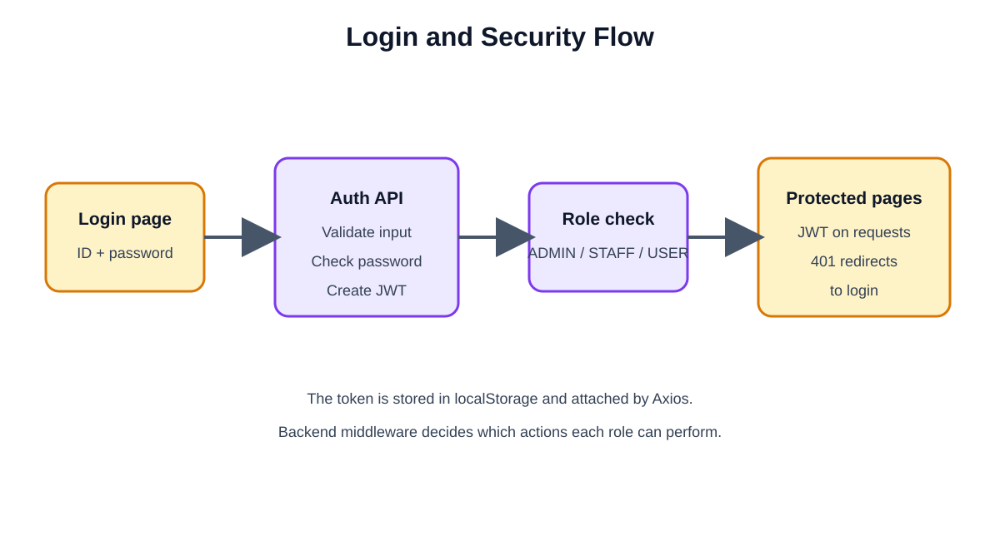
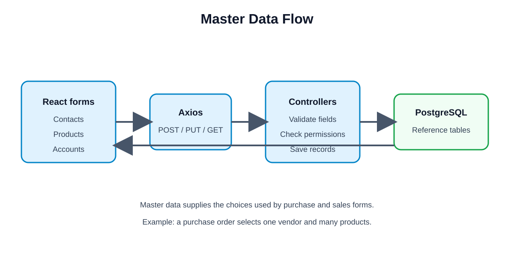
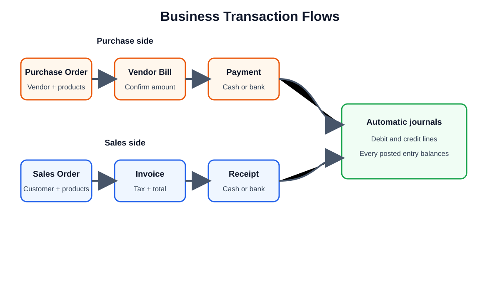
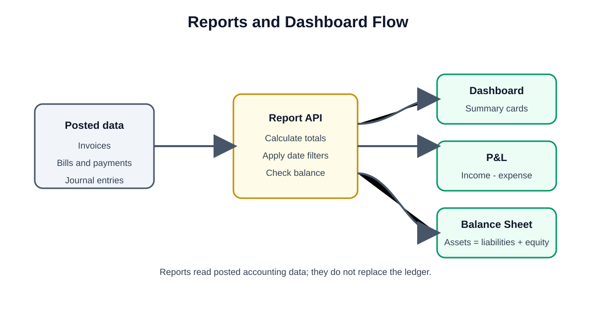

# Urban Furniture: Accounting System (Team 553)

An end-to-end accounting management system built for Urban Furniture hackathon challenge.

## Core Flow
```
Contacts/Products (Master Data)
       ↓
Purchase Order → Vendor Bill → Payment
Sales Order → Customer Invoice → Payment
       ↓
Automatic Journal Entries (Debit/Credit)
       ↓
Balance Sheet + P&L + Budget Report
```

## System Flow Diagrams

### 1. System overview



### 2. Login and security



### 3. Master data



### 4. Business transactions



### 5. Reports and dashboard



## Documentation
- [Architecture & Design (`docs/ARCHITECTURE.md`)](docs/ARCHITECTURE.md)
- [Team Contract (`docs/CONTRACT.md`)](docs/CONTRACT.md)
- [Tech Stack & Judge Q&A (`docs/TECH_STACK_AND_PITCH.md`)](docs/TECH_STACK_AND_PITCH.md)
- [Implementation Plan (`docs/implementation_plan.md`)](docs/implementation_plan.md)
- [Task Checklist (`docs/task.md`)](docs/task.md)

## Team Structure
- **Member 1**: Core Accounting / Backend Models & Business Logic
- **Member 2**: UI / Views / Dashboard & Integration
